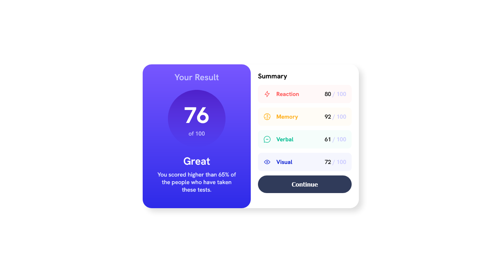
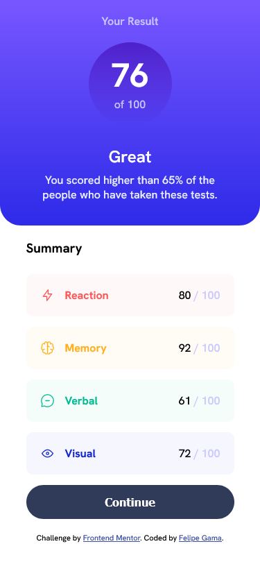

# Frontend Mentor - Solução de componente de resumo de resultados

Esta é uma solução para o [desafio do componente de resumo de resultados no Frontend Mentor](https://www.frontendmentor.io/challenges/results-summary-component-CE_K6s0maV). Os desafios do Frontend Mentor ajudam você a melhorar suas habilidades de codificação criando projetos realistas.

## Índice

- [Visão geral](#visão geral)
   - [O desafio](#o-desafio)
   - [Captura de tela](#captura-de-tela)
   - [Links](#links)
- [Meu processo](#meu-processo)
   - [Construído com](#construído-com)
   - [O que aprendi](#o-que-aprendi)
   - [Desenvolvimento contínuo](#desenvolvimento-contínuo)
   - [Recursos úteis](#useful-resources)
- [Autor](#autor)

## Visão geral

### O desafio

Os usuários devem ser capazes de:

- Veja o layout ideal para a interface, dependendo do tamanho da tela do dispositivo
- Veja os estados de foco e foco para todos os elementos interativos na página

### Captura de tela




### Links

- URL da solução: (https://github.com/felipe1590/results-summary-component)
- URL do site ao vivo: (https://felipe1590.github.io/results-summary-component/)

## Meu processo

### Construído com

- Marcação HTML5 semântica
- Propriedades personalizadas CSS
- Flexbox
- Fluxo de trabalho mobile first

### O que eu aprendi

```html
<section class="resultado-topo">
      <section class="resultado">
        <h1 class="titulo-resultado">Your Result</h1>
        <div class="score">
          <p class="score-resultado">76</p>
          <p class="max-score-resultado">of 100</p>
        </div>
      </section>
```
Os trexos foram estruturados dessa forma, pois achei que seria mais simples quando fosse nescessario o manupulação para outras mídias, já que cada linha importante tem sua própria classe, assim como os containes a quais pentencem. A mesma estruturação pode ser vista em um dos recursos no qual indiquei abaixo.
Foi um desafio muito interessante, pois algumas vezes me peguei amarrado a erros simples, mas que mostraram onde devo focar mais meus estudo de técnicas de css.

```css
.reaction-sumario, .memory-sumario, .verbal-sumario, .visual-sumario {
    display: flex;
    justify-content: space-between;
    padding: 20px;
    border-radius: 10px;
}
```
Esse aqui foi resultado em vários aprendizados, que por mais que pareçam simples, quando se está no começo de uma jornada para se tornar um Dev Web, essas coisas são bem dasafiadoras, mas não existe nada que eu goste mais do que uma boa solução. Sei que ainda tenho muito o que melhorar, mas acho que cheguei a uma solução satisfatória.

### Desenvolvimento contínuo

Estou focando em aprender sobre layouts responsivos e como posso integrar isso ao JavaScript, desenvolvendo meus conhecimentos de maneira estruturada e focada no estudo aplicado do Front-end, depois de terminar todos os módulos do curso de Html e Css do Curso em Vídeo(https://www.cursoemvideo.com/) e partir para o básico de JavaScript. Estou enpenhado em produzir sites bonitos, mas semanticamente bem feitos, utilizando técnicas atualizadas de css, empregradas aos scripts simples.

### Recursos úteis

- [LANDING PAGE COM HTML e CSS!](https://www.youtube.com/watch?v=llF6vD-RljE&ab_channel=RafaellaBallerini) - Isso me ajudou simplesmente a entender como funciona o Flexbox e como o posicionamente pode ser usado em determinados momentos, integrando as técnicas mais tradionais de como montar uma página de manera responsiva. Eu realmente gostei desse padrão e vou usá-lo daqui para frente.
- [A Complete Guide to Flexbox](https://css-tricks.com/snippets/css/a-guide-to-flexbox/) - Este é um artigo incrível que me ajudou a finalmente entender mais a fundo como Flexbox ao mesmo tempo pode parecer complexo no começo, mas o treino e tempo mostram que essa inovação só tem a agregar na criação de sites de maneira mais descomplicada. Recomendo a todos que ainda estão aprendendo esse conceito.

## Autor

- Website - [Felipe Gama](https://felipe1590.github.io/portfolio/)
- Frontend Mentor - [@felipe1590](https://www.frontendmentor.io/profile/felipe1590)
- Linkedin - [Felipe Gama](https://www.linkedin.com/in/felipe-gama-3a5638265/)
